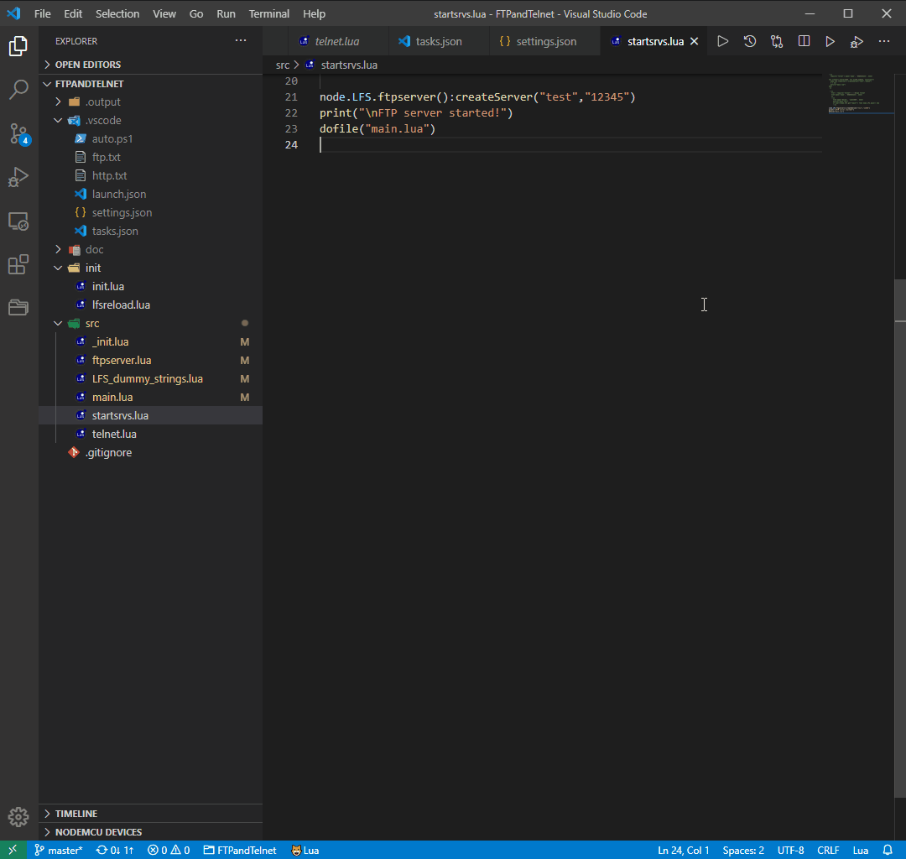
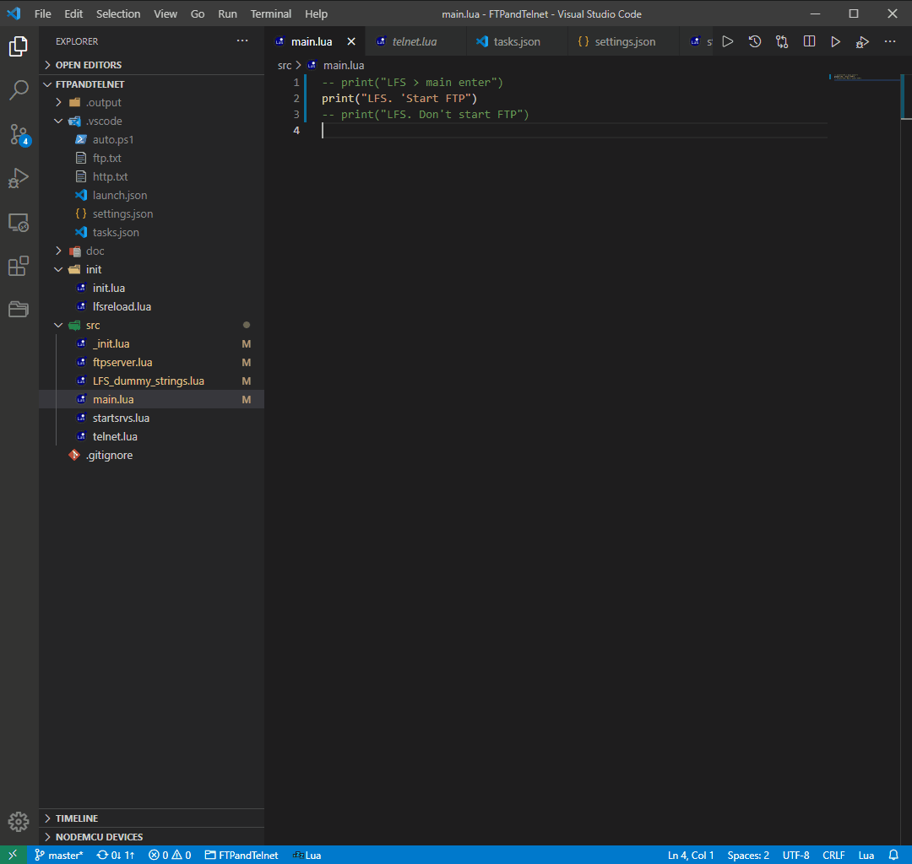

# vscauto

Visual Studio Code scripts and commands for compile, upload and run Lua files on ESP8266, ESP-32.

Version for Windows is in `.vscode` directory, version for Linux in `forLinux`.





# Install

Install **[nodemcu-tool](https://github.com/AndiDittrich/NodeMCU-Tool)**

Install **[LuaSrcDiet](https://github.com/jirutka/luasrcdiet#using-luarocks)** (optional)

Enable PowerShell scripts execution (on Windows only):

```
Run (admin) Windows PowerShell -> Set-ExecutionPolicy Unrestricted -> "A"
```

Create folders

```
workspace_folder
|
|___.output
|   |    -- empty
|
|___.vscode
|   | *  -- files from this repository
|
| *.lua  -- your files in the workspace

```

In order to execute the "COM: LFS build, upload & flashreload" command, you need to write the file **lfsreload.lua** to spiffs.

# Settings

File **ftp.txt**  - device IP address, credentials for the FTP server

File **http.txt** - device IP address

File **auto.ps1** - $lfs_size, $lfs_base, $lfs_mapped<br>
or **auto. sh**

*$lfs_base* and *$lfs_mapped* uses only for an LFS absolute image (luac.cross with -a \<baseAddr\> option.)
